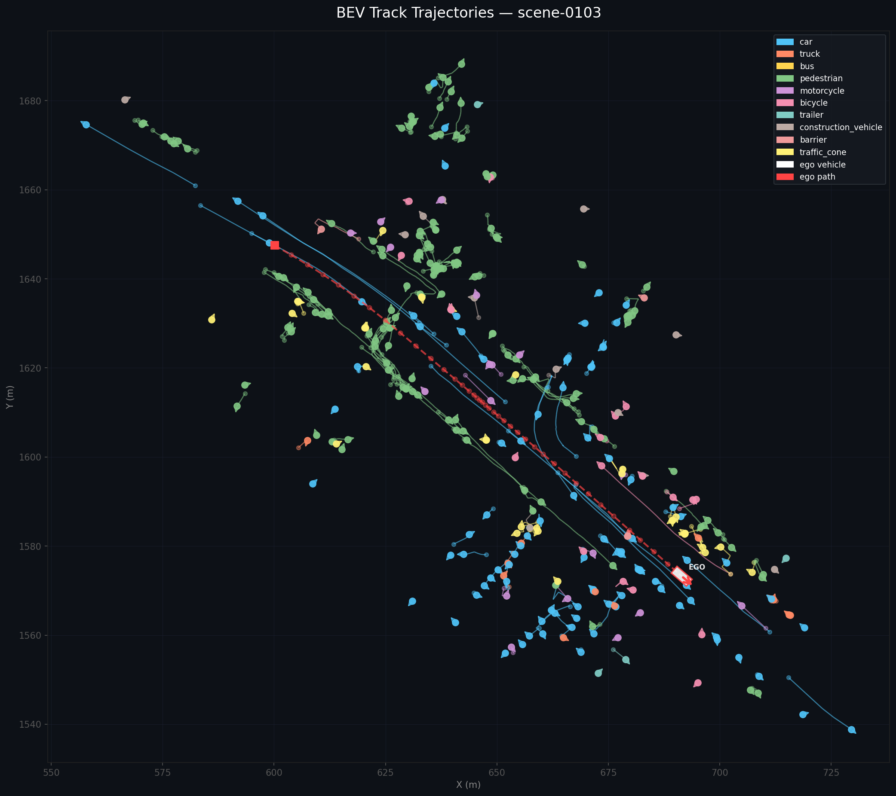

# LiDAR 3D Object Tracking Pipeline

A full pipeline for 3D multi-object tracking on the [nuScenes](https://www.nuscenes.org/) dataset,
built on top of [OpenPCDet](https://github.com/open-mmlab/OpenPCDet).

---

## What This Does

```
nuScenes mini dataset (LiDAR point clouds)
            │
            ▼
   CenterPoint detector
   (voxel_size=0.075, pretrained on nuScenes)
   outputs: [x, y, z, w, l, h, heading, vx, vy] per object
            │
            ▼
   Kalman Filter Tracker (written from scratch)
   state vector: [px, py, pz, vx, vy, vz, heading]
   matching: Hungarian algorithm (linear_sum_assignment)
            │
            ▼
   Persistent object tracks with IDs across frames
            │
            ▼
   BEV visualization with ego vehicle trajectory
```

---

## Results

Trajectory visualization for `scene-0103` — all tracked objects in Bird's Eye View.
The **white rectangle** is the ego vehicle at its final position, the **dashed red line** is its path through the scene.
Each color represents a different object class.



---

## Stack

| Component | Choice | Why |
|---|---|---|
| Detection | CenterPoint (voxel 0.075) | Predicts velocity directly, ideal for tracking |
| Framework | OpenPCDet | Clean codebase, no mmcv dependency hell |
| KF state | `[px, py, pz, vx, vy, vz, heading]` | 7D, heading-aware |
| Matching | Hungarian algorithm | Optimal assignment, O(n³) |
| Dataset | nuScenes mini (v1.0-mini) | 10 scenes, 2 Hz keyframes |

---

## Files

```
kf_tracker_with_heading.py   — Kalman filter tracker, outputs tracking_results_with_heading.json
visualize_tracks.py          — BEV visualizer, reads JSON and writes plots to visualization_output/
```

---

## How to Run

### 1. Run inference with CenterPoint

```bash
cd /workspace/tools

python3 test.py \
    --cfg_file cfgs/nuscenes_models/cbgs_voxel0075_res3d_centerpoint.yaml \
    --ckpt ../output/nuscenes_models/cbgs_voxel0075_res3d_centerpoint/cbgs_voxel0075_centerpoint_nds_6648.pth \
    --batch_size 1 \
    --set DATA_CONFIG.VERSION v1.0-mini
```

Outputs detections to `results_nusc.json`.

### 2. Run the Kalman filter tracker

```bash
python3 kf_tracker_with_heading.py
```

Outputs `tracking_results_with_heading.json`.

### 3. Visualize

```bash
pip install matplotlib

python3 visualize_tracks.py \
    --nusc_root /path/to/nuscenes/v1.0-mini \
    --outdir visualization_output

# Optional: animated GIF (requires imageio)
pip install imageio
python3 visualize_tracks.py --animate
```

Outputs land in `visualization_output/`:
- `scene-XXXX_trajectories.png` — all tracks + ego path
- `scene-XXXX_per_class.png` — per-class subplot breakdown
- `scene-XXXX_animation.gif` — frame-by-frame animation (optional)

---

## Kalman Filter Design

The tracker uses a **constant velocity motion model** with heading:

```
State:        x = [px, py, pz, vx, vy, vz, heading]
Motion model: F  (constant velocity, dt=0.5s)
Measurement:  z = [px, py, pz, vx, vy, heading]  (from CenterPoint output)
Process noise:  Q — tuned for nuScenes vehicle dynamics
Measurement noise: R — tuned for CenterPoint detection accuracy
```

Key design decisions:
- **dt = 0.5s** — nuScenes annotated keyframe interval (2 Hz)
- **Heading wraparound** — residual uses `arctan2` to avoid ±π discontinuity
- **Scene reset** — tracker state is reset between scenes to prevent ghost tracks
- **Score threshold** — detections below 0.3 confidence are filtered before tracking

---

## Notes

- Detection model is pretrained on the full nuScenes trainval set — no fine-tuning done
- mini_val has only 2 scenes (81 frames) so rare classes (trailer, barrier) score 0 AP — expected
- Tracker runs in pure Python + numpy, no CUDA needed at inference time